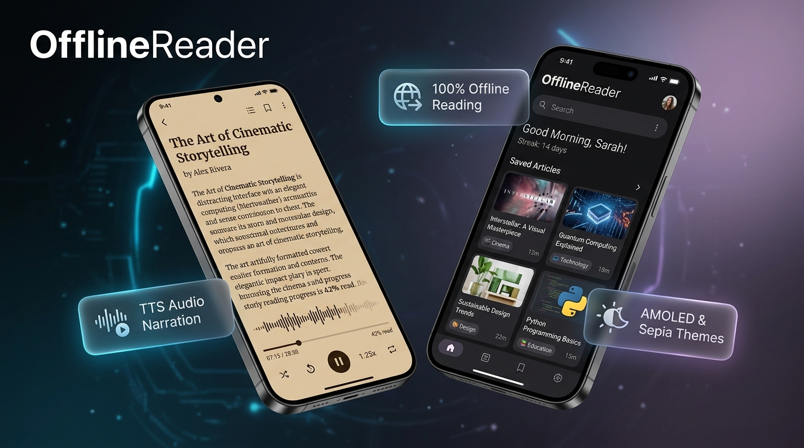

# Loqu

An offline-first reader for long-form articles and screenplays, with read-aloud
that keeps playing when the screen is off. No account, no server, no ads, no
analytics.

You paste a URL. The phone itself fetches the page, strips it down to the text,
and stores it locally. From then on it opens with no signal — on a plane, on the
subway, anywhere. Nothing is uploaded, because there is nothing to upload to:
**this app has no backend at all.**



---

## Why this exists

Pocket shut down in July 2025 after 18 years. The replacements are either
cloud services that want an account and a subscription, or self-hosted tools
that want Docker and a VPS. I wanted the boring middle option: an app that
saves a page to my phone and reads it to me on the way to work.

## What it does

- **Save any article link** — fetched and cleaned on the device, then readable forever offline
- **Read aloud that survives the screen turning off** — a proper Android media
  foreground service owns the speech engine, so playback continues when you leave
  the app or lock the phone. Lock-screen and notification transport controls,
  speed 0.8x–2.0x, an incoming call pauses it and it resumes afterwards, and
  unplugging headphones pauses instead of blasting the room.
- **Follows along while it reads** — the paragraph being spoken is highlighted and
  the page scrolls to it; dragging the page yourself suspends the follow for a few seconds
- **Resumes where you stopped** — reopening a half-listened article picks up at the
  same point, not at the top
- **Screenplay mode** — keeps the monospace column and bolds `INT.` / `EXT.` / `FADE IN` so scripts are actually readable on a phone
- **4 reading themes** — light, dark, AMOLED black, sepia paper; adjustable font size and family
- **Reading stats** — daily streak, words read, minutes listened, category breakdown
- **7 UI languages** — English, Spanish, German, French, Turkish, Azerbaijani, Russian

## What it does NOT do

Being explicit so nobody downloads this expecting something it isn't:

- **No sync between devices.** There is no server, so there is nothing to sync through.
- **No playback queue.** You listen to one article at a time, not a playlist.
- **No iOS build** yet. Android only.
- **No import** from Pocket/Instapaper/Omnivore exports yet.
- **No PDF or EPUB.** Web pages and screenplay pages only.
- **Not every site parses cleanly.** Sites that render text purely in JavaScript
  will come back thin or empty, because the extraction is plain HTML parsing on
  the device, not a headless browser.

## Permissions

The whole list, and why:

| Permission | Why |
|---|---|
| `INTERNET` | to fetch a page the one time you save it |
| `ACCESS_NETWORK_STATE` | declared by the React Native framework, not by app code |
| `VIBRATE` | haptic feedback on button presses |
| `FOREGROUND_SERVICE` | run read-aloud as a service so it is not killed when you leave the app |
| `FOREGROUND_SERVICE_MEDIA_PLAYBACK` | the specific service type Android 14+ requires for audio playback |
| `POST_NOTIFICATIONS` | the playback notification is the control surface while the app is closed (Android 13+) |
| `WAKE_LOCK` | keep the CPU awake while speaking with the screen off; released the moment playback stops |
| `com.husu.reader.DYNAMIC_RECEIVER_NOT_EXPORTED_PERMISSION` | React Native internal; a self-scoped permission that lets the app talk to its own broadcast receivers. No other app can use it. |

No storage permission. No location. No contacts. No overlay. No ad SDK, no
analytics SDK, no crash reporter. Verify it yourself before installing:

```
aapt2 dump permissions Loqu-1.1.0.apk
```

## Install

1. Download the APK from [Releases](../../releases/latest)
2. Verify the checksum if you care to (the SHA256 is on the release page)
3. Android will warn you about installing outside the Play Store — that warning is
   correct and you should read it. Allow it only if you're comfortable.
4. Requires Android 7.0 (API 24) or newer, arm64 or armeabi-v7a

**This build is signed with a debug key.** It installs and runs fine, but when a
Play Store version eventually ships it will be signed with a different key, and
Android will ask you to uninstall this one first. Saved articles will not carry over.

Upgrading from 1.0.0 installs over the top and keeps your library.

## Known issues in 1.1.0

Honest list, all reproduced:

- Background playback is verified on a stock Android 16 device and on a Redmi Note 8
  Pro for everything except the screen-off endurance case. **Aggressive battery
  managers (MIUI, EMUI, ColorOS) are the case I cannot fully test** — if audio dies
  on yours, that is the bug report I most want.
- Reading-time chips on the Discover screen clip at the right edge on 1080x2340 screens
- Discover feed titles are hardcoded English even when the UI language is not
- Memory churn grows with library size — the whole library is re-parsed on every
  screen refresh. Fine at ~10 articles, not yet tested at 100.

## Feedback

This is not on the Play Store and I have not decided whether to put it there.
That is exactly what I'm trying to find out. If you try it, the useful thing you
can tell me is not "nice app" — it's which of these is true for you:

- offline + read-aloud + no account is enough, sync doesn't matter
- it's useless to me without cross-device sync
- I'd use it only for screenplays
- I would not use this at all, and here's what I use instead

Open an issue, or reply wherever you found this.
